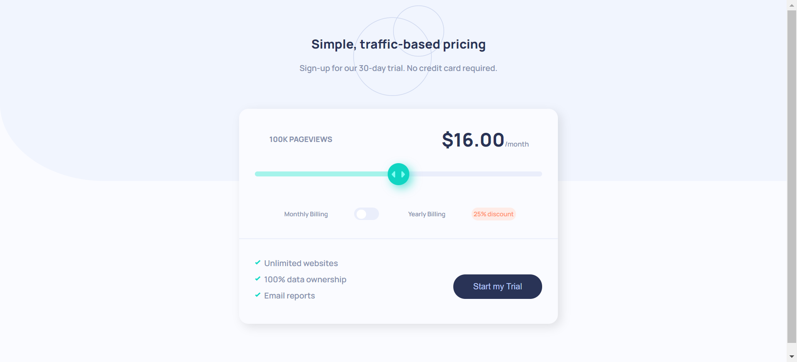

# Frontend Mentor - Interactive pricing component solution

## Table of contents

- [Overview](#overview)
  - [The challenge](#the-challenge)
  - [Screenshot](#screenshot)
  - [Links](#links)
- [My process](#my-process)
  - [Built with](#built-with)
  - [What I learned](#what-i-learned)
  - [Useful resources](#useful-resources)
- [Author](#author)

## Overview

### The challenge

Users should be able to:

- View the optimal layout for the app depending on their device's screen size
- See hover states for all interactive elements on the page
- Use the slider and toggle to see prices for different page view numbers

### Screenshot



### Links

- Solution URL: [Solution](https://www.frontendmentor.io/solutions/interactive-pricing-component-html-css-sass-js-0wYsxLUOP)
- Live Site URL: [Live Site](https://shubhampitale-pc.netlify.app/)

## My process

### Built with

- Semantic HTML5 markup
- CSS custom properties
- Flexbox
- Mobile-first workflow
- Syntactically Awesome Style Sheets(Sass)

### What I learned

**Range Slider**

So this project contains implementation of a Range Slider which I was try out for first time.I got to learn how to make this Range Slider
and how to use HTML and CSS to implement it.

```html
<div class="sliderContainer">
  <input
    min="1"
    max="100"
    value="50"
    type="range"
    class="slider"
    id="myRange"
  />
</div>
```

```css
.slidecontainer {
  width: 100%; /* Width of the outside container */
}

.slider {
  -webkit-appearance: none;
  appearance: none;
  width: 100%;
  height: 25px;
  background: #d3d3d3;
  outline: none;
  opacity: 0.7;
  -webkit-transition: 0.2s;
  transition: opacity 0.2s;
}

.slider::-webkit-slider-thumb {
  -webkit-appearance: none;
  appearance: none;
  width: 25px;
  height: 25px;
  background: #04aa6d;
  cursor: pointer;
}

.slider::-moz-range-thumb {
  width: 25px;
  height: 25px;
  background: #04aa6d;
  cursor: pointer;
}
```

**Toggle Switch**

There was a need of toggle switch for this project and whose HTML and CSS code seemed interesting to me.

```html
<label class="switch">
  <input type="checkbox" />
  <span class="slider"></span>
</label>
```

```css
/* The switch - the box around the slider */
.switch {
  position: relative;
  display: inline-block;
  width: 60px;
  height: 34px;
}

/* Hide default HTML checkbox */
.switch input {
  opacity: 0;
  width: 0;
  height: 0;
}

/* The slider */
.slider {
  position: absolute;
  cursor: pointer;
  top: 0;
  left: 0;
  right: 0;
  bottom: 0;
  background-color: #ccc;
  -webkit-transition: 0.4s;
  transition: 0.4s;
}

.slider:before {
  position: absolute;
  content: "";
  height: 26px;
  width: 26px;
  left: 4px;
  bottom: 4px;
  background-color: white;
  -webkit-transition: 0.4s;
  transition: 0.4s;
}

input:checked + .slider {
  background-color: #2196f3;
}

input:focus + .slider {
  box-shadow: 0 0 1px #2196f3;
}

input:checked + .slider:before {
  -webkit-transform: translateX(26px);
  -ms-transform: translateX(26px);
  transform: translateX(26px);
}

/* Rounded sliders */
.slider.round {
  border-radius: 34px;
}

.slider.round:before {
  border-radius: 50%;
}
```

### Useful resources

- [Range Slider](https://www.w3schools.com/howto/howto_js_rangeslider.asp) - This is well written tutorial on how to make a Range Slider. I implemented CSS part of Range Slider for this project by referring it.
- [Toggle Switch ](https://www.w3schools.com/howto/howto_css_switch.asp) - It helped me to built toggle switch for this project.

## Author

- Frontend Mentor - [@ShubhamPitale](https://www.frontendmentor.io/profile/ShubhamPitale)
- Twitter - [@pitale_shubh](https://twitter.com/pitale_shubh)
